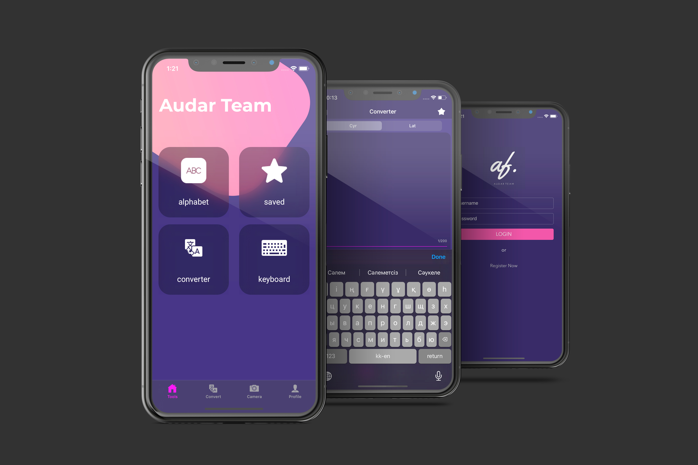

# Portfolio

# Audar
An application that has no analogues in the country for converting Kazakh text from Cyrillic to Latin, the same application can recognize text from a picture, has its own smart keyboard with auto-complete of Kazakh words.

# Exchange
Module of internet banking app ForteBank for exchanging currency.

# Unsplash
App based on open source api unsplash, for sharing photos.

